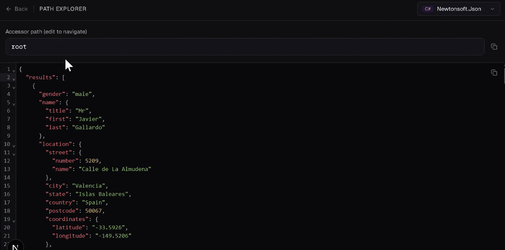

# JSON Prober

**[jsonprober.com](https://jsonprober.com)**

A free online tool for searching through JSON data and generating copy-paste-ready code need to access that data in your language of choice.

## Inspiration

I built this tool primarily to deal with the tedious processes I face when scraping a website. You find a large json payload that has a bunch of data you need, but the JSON is an abomination to mankind that has 10 levels of nesting, duplicate data everywhere, and nonsensical property names. 

You ultimately just need the code to acess the data you need. There are existing tools to find the values or properties you need and their path, but then you have to go through the mind-numbing process of converting each path to the necessary code needed to access the data. This can get annoying, fast. This tool aims to solve that

## Search

Paste or upload your JSON payload, then search by key name, value, or both. JSON Prober walks the entire tree and returns every matching path as ready-to-use code like `root?["data"]?["items"]?[0]` in C# or `node.get("data").get("items").get(0)` in Java.

You can filter by match type (contains, equals, regex, etc.), narrow results by JSON type, run numeric comparisons, and ignore specific keys. Pick your language from the code format dropdown and each result updates instantly. Currently supports C# (Newtonsoft.Json, System.Text.Json), Python, JavaScript/TypeScript, Java (Jackson/Gson), Go, Ruby, PHP, Kotlin, Swift, and Rust.


## Path Explorer

Click any result to open it in the path explorer, or open the full JSON from the main page. The explorer lets you type or edit an accessor path and see the live-beautified JSON at that location. Autocomplete suggests object keys, array indices (with value previews), and method names as you type.

Switching languages in the explorer re-translates your current path into the new format automatically.



## Features

- Search by key, value, or both with contains, equals, starts with, ends with, or regex
- Numeric comparison mode for filtering by number ranges
- Type filtering for strings, numbers, booleans, objects, arrays, or nulls
- Ignore specific keys
- Path explorer with autocomplete and live JSON preview
- Runs entirely in the browser. No data is sent to any server.

## Contributing a new language

Adding support for a new language or library is straightforward. Each one is just a single config object that describes how that language accesses object keys and array indices. Here's what Python looks like:

```typescript
const pythonDict: AccessorDefinition = {
  id: "python-dict",
  label: "Dict / List",
  language: "python",
  description: "Python dictionary bracket access",
  keyAccess: { type: "indexer", template: '["{value}"]' },
  indexAccess: { type: "indexer", template: "[{value}]" },
  stringQuote: '"',
  escapeRules: [
    { char: '"', replacement: '\\"' },
    { char: "\\", replacement: "\\\\" },
  ],
  options: [
    { id: "rootVar", label: "Root variable", type: "string", default: "data" },
  ],
};
```

Create a new file in `src/lib/serializers/presets/`, add your definition, and register it in `presets/index.ts`. That's it. Serialization, autocomplete, and language switching all work automatically from the definition.

If you use a language or library that isn't supported yet, PRs are welcome. Open an issue if you're not sure about the accessor format.

## Running locally

```bash
npm install
npm run dev
```

Then open [http://localhost:3000](http://localhost:3000).

## Tech stack

- Next.js (static export)
- TypeScript
- Tailwind CSS
- CodeMirror 6
- Zustand

## License

MIT
